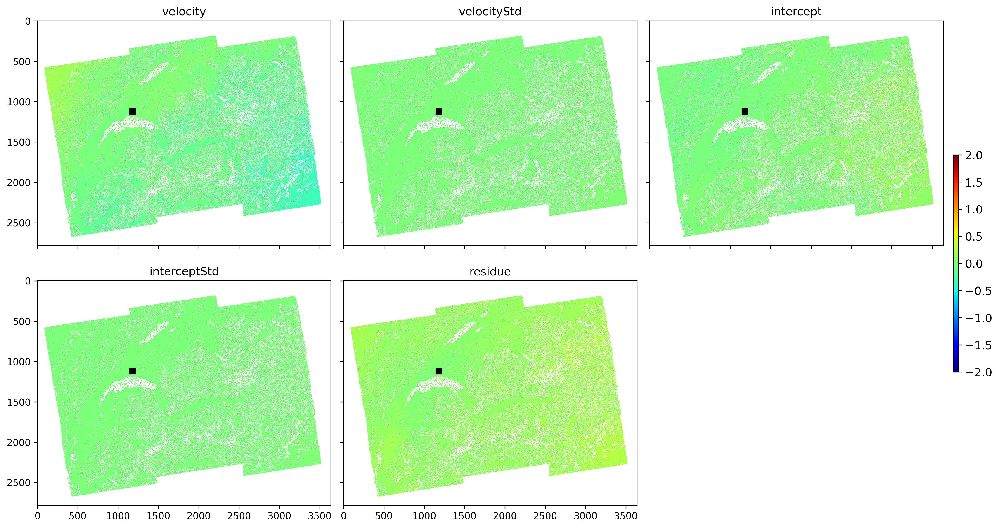

# 🛰️ Satellite InSAR Geodetic Monitoring for CERN Underground Infrastructure

An end-to-end spaceborne synthetic aperture radar (SAR) time-series processing pipeline and interactive geodetic deformation dashboard. This project processes multi-year Sentinel-1 C-band SAR stacks using Small BAseline Subset (SBAS) inversion via MintPy to measure millimeter-level surface deformation, mapping sub-surface structural risk for accelerator caverns and tunnel networks.

---

## 📊 Key Results & Geodetic Visualizations

### 1. Cumulative Displacement Map

### 2. Line-of-Sight (LOS) Velocity Field

---

## 🗂️ Core Repository Deliverables

* 💻 **`app.py`**: Streamlit interactive web application for real-time pixel time-series extraction and anomaly thresholding.
* 📓 **`Untitled.ipynb`**: Complete Python / MintPy SBAS inversion and time-series processing notebook.
* 🗺️ **`velocity.kmz`**: 3D spatial velocity map formatted for interactive inspection in Google Earth.
* 📊 **`cern_insar_anomalies.xlsx`**: Filtered geodetic risk report capturing high-subsidence pixels ($<-30\text{ mm}$).

---

## 🚀 Interactive Streamlit Dashboard Features

* **Point Time-Series Extraction:** Allows users to query exact column ($X$) and row ($Y$) coordinates to render local ground displacement trends over time.
* **Automated Anomaly Detection:** Dynamically scans the full spatial extent for pixels breaching pre-set displacement thresholds.
* **Geotechnical Report Export:** Generates structured anomaly reports (`.csv`/`.xlsx`) for structural engineering evaluation.
